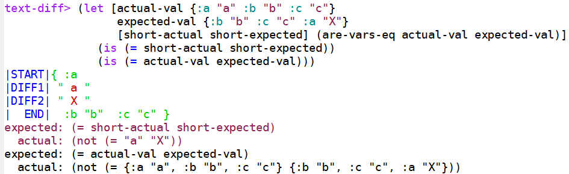

# Rational

The Clojure function 'text-diff/are-vars-eq' helps to quickly show small differences during testing with large bodies of html, convoluted maps/sets/lists/vectors, and unordered maps/sets. When unequal actual and expected values are tested, a short description of the similarities and differences are printed in the REPL. First, leading identical sections are displayed, followed by differences, and then finally identical ending sections.  

### How to use  

```
;; clojure test file
(ns my-test-ns
    (:require [clojure.test :refer [is]])
    (:require [text-diff :refer [are-vars-eq]]))

(deftest test-html-values []
  (let [actual-value   "<same>DIFFERENT</same>"
        expected-value "<same>different</same>"
        [diff-actual diff-expected] (are-vars-eq actual-value expected-value)]
    (is (= diff-actual diff-expected)))
)
```

      
```
;; repl output
|START|"<same>"
|DIFF1|"e>DIFFERENT</"
|DIFF2|"e>different</"
|  END|"</same>"
      
expected (= diff-actual diff-expected)
actual (not (= "DIFFERENT" "different"))
false
```
      
###Examples






---



---



---



---




---




---



---
Odd string behavior that is to be expected from string differences inside maps/sets/lists/vectors. Quote delimiters cause extra blank spaces because variable types are not taken into account.





















